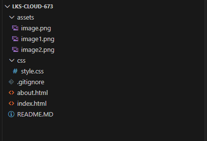

# web Deployment - LKS Cloud Computing 2026

## 📝 Deskripsi Proyek
Aplikasi ini adalah sebuah website aplikasi statis yang dibangun untuk memenuhi kualifikasi LKS SMK Ma'arif NU Jatim 2026. Proyek ini mendemonstrasikan Intergrasi CI/CD menggunakan GitHub sebagai version Control dan Vercel sebagai Platform as a service (Paas).

**Fitur Dinamis**
* **Kontent edukasi**: Penjelasan mengenai Cloud Comouting (Iaas,Paas,Saas).
* **Fitur Dinamis**: Mengambil data secara asinkron dari API PUblik (JSONPlaceholder).
* **Logging System**: Pemantauan status aplikasi melalui browser console.
* **Responsive Design**: Tampilan optimal diberbagai perangkat.

## 📂 Struktur Folder 
Penyusunan File didalam Folder dilakakukan secara terorganisir untuk memenuhi standar kerapian

## 🚀 Langkah Deployment 
1. **Persiapkan Kode:** Pastikan file index.html, about.html, dan style.css sudah siap didalam folder proyek.
2. **Uploud ke GitHub:** Buat repository baru di GitHub, lalu unggah semua file kedalam 